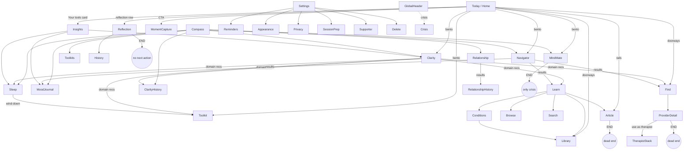

# Psychage Mobile — Experience Architecture Audit

**Date:** 2026-06-17
**Scope:** Whole `apps/mobile` app evaluated as one connected ecosystem (not screen-by-screen).
**Method:** Full route-graph trace of every screen's entry points, exit CTAs (`router.push`/`Link` targets), and dead ends.
**Constraint noted:** A large uncommitted working tree (~203 files — typography/token migration + onboarding cut 7→2 screens) is in flight. This audit describes architecture, not that diff. Implementation must not collide with it.

---

## 1. Experience Architecture Map

### Tab IA (4 tabs)

```
Today  |  Learn  |  Compass  |  Find
```

Crisis ("Help now" pill) + account avatar live in `GlobalHeader`, reachable ≤1 tap on every tab screen (SR-2 honored).

### Route groups

- **(today)** — `index` (home/mission-control), `history`, `reflection`, `reflection-earlier`
- **(learn)** — `learn`, `article/[slug]`, `conditions`, `conditions/[slug]`, `learn/[category]`, `learn/browse`, `learn/search`, `library` (WebView), `saved`
- **(compass)** — `compass`, `toolkits`, `toolkits/[id]`, `tools/{mindmate,mood-journal,relationship-health,sleep,med-tracker}`
- **(find)** — `find`, `find/directory`, `find/provider/[id]`, `find/compare`
- **(therapist)** — `why`, `add-provider`, `range`, `preview`  *(share-to-therapist PDF flow)*
- **(auth)** — welcome, sign-in/up, verify, forgot/reset, migrate, session-expired, sign-out
- **onboarding** — `welcome`, `moment` *(cut from 7 screens to 2)*
- **settings/** — hub + 13 sub-screens
- **ROOT full-screen (tab bar hidden):** `navigator`, `tools/clarity`, `tools/clarity-history`, `tools/navigator-history`, `tools/relationship-history`, `toolkit`, `insights`, `crisis`, `crisis-region`, `tool/[id]`

### Connection graph (actual edges, not intended)



**Reads of the graph:**
- **Clarity** and **Navigator** are the *only* well-connected assessments (rich outbound result CTAs). They are the model to copy.
- **Article**, **MindMate**, **Reflection**, **ProviderDetail** terminate journeys.
- **Insights** has *one* inbound edge (Home "Your tools"). **Therapist share** has *one* inbound edge (Find → provider → "use as therapist"). Both are near-orphans.
- **MindMate** has *zero* contextual inbound edges — nothing feeds the AI a result to discuss, despite it being the natural connective tissue.

---

## 2. User Journey Stress Test

| User type | Path | Failure points |
|---|---|---|
| **New** | welcome → onboarding/welcome → first moment → home (capture sheet auto-opens) | Onboarding is solid. But after first moment, home shows empty rails (Pick-up, Most-read may be fine; "Your tools" empty). Tools live one tab over in Compass with no first-run nudge. Nothing teaches *why* to use Clarity/Navigator. |
| **Returning (daily)** | open app → home status line ("Not checked in today · Yesterday: …") → capture | Works — *if* they remember to open. No notification pulls them back (see §4). Status line answers "what changed" well. |
| **Returning (weekly)** | home reflection row appears after 7 days | Good trigger. But reflection is read-only → drops user with no next action. |
| **Power** | Compass → any tool | Compass is a flat tool drawer — efficient. But cross-tool flow is weak: finishing Clarity won't surface Insights or MindMate; results don't chain into each other. |
| **Lost** | any deep full-screen flow (Navigator/Clarity/Toolkit) | Tab bar hidden during these; back button is the only exit. If a result screen lacks a forward CTA, back is the *only* move — a soft trap. |
| **Curious** | exploring | Insights + Therapist share are nearly undiscoverable. Article → tool path doesn't exist, so content browsing never converts to tool use. |

---

## 3. Feature Connection Audit

**Intended chain:** Assessment → Report → Insights → MindMate → Journal → Clarity → Progress → Home.

**Reality:**
- ✅ Clarity → Find/Toolkit/Learn/Sleep/History
- ✅ Navigator → MoodJournal/Find/Learn
- ✅ Sleep → Toolkit (wind-down)
- ❌ Article → *nothing* (island — content never converts to action)
- ❌ Any result → MindMate (AI gets no context handoff)
- ❌ Any tool → Insights (Insights is a leaf only Home links to)
- ❌ Clarity ↔ Navigator (the two assessments don't cross-reference)
- ❌ Reflection → next action

**Orphaned / near-orphaned features:**
- **Insights** — 1 inbound (Home card). No Compass tile, no tab.
- **Therapist share `(therapist)` stack** — 1 inbound (Find provider button). `why.tsx` consent intro effectively unreachable. This is one of the **four V1 spec features** and it's buried.
- `tools/relationship-history`, `tools/navigator-history` — reachable only from their own result screens.

**Dead-end screens (terminate, no forward action):**
1. **`article/[slug]`** — ends at citations + disclaimer. No related rail, no tool CTA, no next article. *(Highest-traffic dead end.)*
2. **`reflection`** — read-only lookback; only "see full record".
3. **Milestone celebration** — auto-dismiss 2.4s, no "next goal".
4. **MindMate** — no next step beyond crisis pill.
5. **ProviderDetail** — no "similar providers" rail (has contact/save/use-as-therapist, so partial).
6. **Mood Journal / Sleep** — open-ended logging, no completion forward step.

---

## 4. Retention Loop Audit

| Loop | Status |
|---|---|
| **Daily** | Capture is frictionless (2 taps). **But the daily return trigger is inert: reminders screen is UI-only; no `expo-notifications`, no scheduling.** Return depends entirely on the user remembering. *(Biggest retention leak — but BLOCKED: push is an open decision per workspace CLAUDE.md §5.)* |
| **Weekly** | Reflection row after 7 days — good trigger, weak payoff (read-only). |
| **Progress** | Terrain (14-day band) is the only progress narrative. Cumulative-only by rule (no streaks — correct). No "next milestone" breadcrumb after a celebration. |
| **Reflection** | Unidirectional — no "carry one focus into this week". |
| **AI engagement** | MindMate has no inbound context, no resurfacing. |
| **Insight** | Orphaned; empty for new users; no "your insight is ready" promotion. |
| **Content** | Reading leads nowhere (no related rail, no tool conversion). |

---

## 5. Navigation Audit

- ✅ No hard traps; back gesture always works; crisis ≤1 tap everywhere.
- ⚠️ Root full-screen flows hide the tab bar (Navigator, Clarity, Toolkit, Insights). Fine for focus, but pair with weak result CTAs = "back is the only exit" soft traps.
- ⚠️ `(therapist)/why.tsx` exists but has no inbound route → dead screen.
- ⚠️ Two privacy-named screens (`privacy` = data controls, `privacy-policy` = legal) — distinct purposes, but the naming collision risks confusion.
- ✅ Settings IA is calm and linear; no orphans within settings.

---

## 6. Home / Mission Control Stress Test

3-second test on home:
- **What changed?** ✅ explicit status line.
- **What matters?** ✅ greeting + terrain.
- **What needs attention?** ◑ bridge card ("something steadying?") + crisis pill.
- **What next?** ✅ adaptive CTA (check-in / dormant nudge / quiet affirm).

Home is the *strongest* surface. Issues: **card stack is long** (status, record well, tools summary, primary action, home-card slot, pick-up rail, tools bento, most-read, care&learning, footer) → cognitive load + buries the one Insights door. New-user home has several empty rails.

---

## 7. Emotional Journey Audit

Intended: Curiosity → Reflection → Understanding → Clarity → Action → Progress → Motivation.

- ✅ Capture → terrain → reflection is a calm, non-judgmental arc (person-first, cumulative-only).
- ❌ **Understanding → Action breaks:** after an assessment result or an article, there's often no next step → insight without action → motivation leaks.
- ❌ **Progress → Motivation breaks:** milestone fires once then vanishes with no forward goal.
- ⚠️ Empty Insights for a new user reads as "you have nothing" — mild deflation.

---

## 8. Friction Inventory (prioritized)

Legend: **Impact** / **Effort** / **Status** (🟢 buildable now · 🟡 needs Dr. Dobson copy review · 🔴 blocked by open decision).

### High severity
| # | Issue | Impact | Effort | Status |
|---|---|---|---|---|
| H1 | Article reader is a dead end — no related rail, no tool CTA | High | Med | 🟢 |
| H2 | No daily return trigger (reminders inert, no push) | Highest | High | 🔴 push is open decision |
| H3 | Therapist share (a V1 feature) buried — 1 inbound, `why.tsx` unreachable | High | Low | 🟡 copy exists |
| H4 | Insights orphaned (1 inbound, no tab/tile) | High | Low | 🟢 |
| H5 | MindMate has no inbound context handoff from results | High | Med | 🟡 |

### Medium severity
| # | Issue | Impact | Effort | Status |
|---|---|---|---|---|
| M1 | Reflection has no next action | Med | Low | 🟡 |
| M2 | Milestone celebration has no "next goal" breadcrumb | Med | Low | 🟢 |
| M3 | Home card stack long → cognitive load; Insights door buried | Med | Med | 🟢 |
| M4 | Clarity ↔ Navigator don't cross-reference | Med | Low | 🟡 |
| M5 | New-user home has empty rails + no tool education | Med | Med | 🟡 |
| M6 | ProviderDetail no "similar providers" | Low-Med | Med | 🟢 |

### Low severity
| # | Issue | Impact | Effort | Status |
|---|---|---|---|---|
| L1 | `privacy` vs `privacy-policy` naming collision | Low | Low | 🟢 |
| L2 | Full-screen flows hide tab bar (orientation) | Low | Med | 🟢 |
| L3 | `library` WebView island vs native `saved` | Low | Med | 🟢 |

---

## 9. Prioritized Improvement Roadmap

### Quick wins (high impact / low effort) — buildable now
1. **H4 — Surface Insights.** Add a Compass tile + promote on Home only when ≥1 tool has data. *(No clinical copy.)*
2. **H3 — Surface Therapist share.** Wire `(therapist)/why.tsx` consent intro into Settings "Data" card and a Home/SessionPrep entry. *(Screens + copy already exist.)*
3. **M2 — Milestone "next goal" breadcrumb.** "N moments to your next milestone" on Home (data already computed).
4. **L1 — Rename** one privacy screen to remove the collision.

### Strategic (med effort / high impact)
5. **H1 — Close the content loop.** Article end-of-read: "Related reading" rail (same-category query) + one contextual tool CTA. Converts browsing → action.
6. **H5 + M4 — AI/result connective tissue.** "Talk this through with MindMate" + cross-links on Clarity/Navigator results; seed MindMate with the result context. *(Copy review.)*
7. **M1 — Reflection forward action.** Gentle "carry one focus into this week" step.
8. **M3 — Home progressive disclosure.** Collapse/reorder the card stack; elevate the Insights door.

### Architecture (long-term / structural)
9. **H2 — Real retention engine.** Implement `expo-notifications` daily reminder scheduling. **BLOCKED** — push is an open decision (workspace CLAUDE.md §5). Needs a V1-or-defer decision first.
10. **Insights into tab IA** (consider a 5th surface or fold into Today) — larger IA change.
11. **`library` WebView → native** to end the content island.

---

## 10. Final Ecosystem Scorecard

| Question | Verdict |
|---|---|
| Every feature connects to another? | ❌ Article, MindMate, Insights, Therapist share weakly/not connected |
| Any dead ends? | ❌ Article, Reflection, MindMate, milestone |
| Users always guided to value? | ◑ on Home yes; off Home (results/articles) often no |
| App creates momentum? | ◑ capture loop yes; cross-feature momentum breaks at "understanding → action" |
| Retention loops emerge? | ❌ daily trigger inert; weekly/insight loops weak |
| Feels intentional? | ✅ strongly (safety, calm voice, person-first) |
| Feels cohesive? | ◑ surfaces are individually excellent; the *connective tissue between them* is the gap |
| World-class? | Not yet — it's a set of strong rooms without enough doors between them |

**One-line diagnosis:** Psychage is a collection of well-built, individually-excellent surfaces. The product gap is *between* screens — broken forward momentum after assessments/articles, orphaned high-value features (Insights, Therapist share), and an inert daily-return engine. Fixing the connective tissue (not the screens) is the highest-leverage work.
